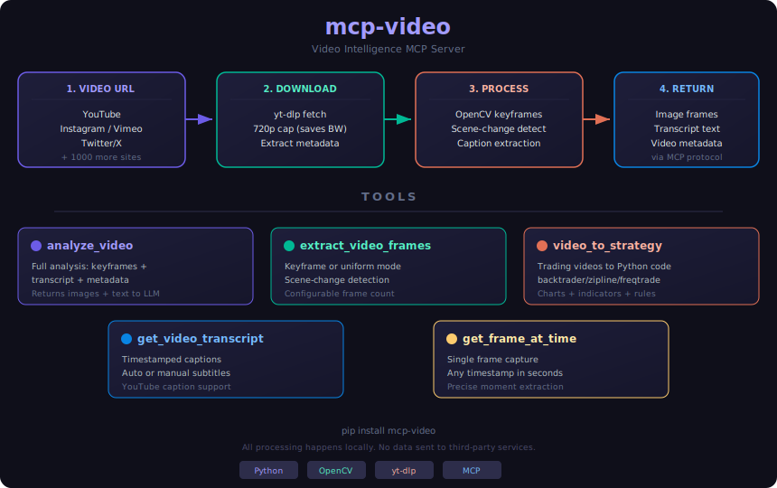

# mcp-video

Video intelligence MCP server for AI-powered video analysis. Extract keyframes, transcripts, and visual content from any video URL — right inside Claude Code or any MCP client.

<p align="center">
  
</p>

## What it does

Point it at any video (YouTube, Vimeo, Twitter/X, Instagram, and [1000+ sites](https://github.com/yt-dlp/yt-dlp/blob/master/supportedsites.md)) and get:

- **Keyframe extraction** — scene-change detection picks the most meaningful frames
- **Transcript extraction** — auto-captions or manual subtitles with timestamps
- **Full analysis** — frames + transcript together for comprehensive video understanding
- **Timestamp snapshots** — grab a frame at any specific moment
- **Video-to-strategy** — extract trading strategies from YouTube/Instagram tutorials and generate runnable Python code (backtrader, zipline, pandas-ta, freqtrade)

Works with Claude's vision capabilities to understand what's actually shown in the video, not just what's said.

### Trading Strategy Extraction

Point it at any trading tutorial video and get a complete, runnable strategy:

```
Convert this trading strategy to code: https://youtube.com/watch?v=...

Extract the RSI strategy from this video and generate backtrader code: https://youtube.com/watch?v=...
```

It extracts chart patterns, indicators, entry/exit rules from the video frames and transcript, then generates code for your preferred framework.

## Install

```bash
# Requires Python 3.10+ and ffmpeg
pip install mcp-video

# Or with uv
uv pip install mcp-video
```

### System dependencies

```bash
# macOS
brew install ffmpeg yt-dlp

# Ubuntu/Debian
sudo apt install ffmpeg
pip install yt-dlp

# Windows
choco install ffmpeg yt-dlp
```

## Usage with Claude Code

Add to your Claude Code MCP config (`~/.claude/claude_code_config.json`):

```json
{
  "mcpServers": {
    "video": {
      "command": "mcp-video",
      "args": []
    }
  }
}
```

Then in Claude Code, just ask:

```
Analyze this video: https://youtube.com/watch?v=...

What code is shown in this tutorial? https://youtube.com/watch?v=...

Summarize the key points from this talk: https://youtube.com/watch?v=...
```

## Usage with any MCP client

```bash
# Run as stdio server (default)
mcp-video

# Run as HTTP server
python -m mcp_video.server --transport streamable-http
```

## Tools

### `analyze_video`
Full video analysis — extracts keyframes and transcript, returns images + text.

| Parameter | Type | Default | Description |
|-----------|------|---------|-------------|
| `url` | string | required | Video URL |
| `max_frames` | int | 8 | Max keyframes to extract |
| `include_transcript` | bool | true | Include captions |

### `extract_video_frames`
Extract frames only, with keyframe detection or uniform spacing.

| Parameter | Type | Default | Description |
|-----------|------|---------|-------------|
| `url` | string | required | Video URL |
| `max_frames` | int | 10 | Number of frames |
| `mode` | string | "keyframe" | "keyframe" or "uniform" |

### `get_video_transcript`
Get timestamped transcript/captions.

| Parameter | Type | Default | Description |
|-----------|------|---------|-------------|
| `url` | string | required | Video URL |

### `get_frame_at_time`
Extract a single frame at a specific timestamp.

| Parameter | Type | Default | Description |
|-----------|------|---------|-------------|
| `url` | string | required | Video URL |
| `timestamp` | float | required | Time in seconds |

### `video_to_strategy`
Extract trading strategies from tutorial videos and generate runnable code.

| Parameter | Type | Default | Description |
|-----------|------|---------|-------------|
| `url` | string | required | Video URL with trading strategy |
| `framework` | string | "backtrader" | Target: backtrader, zipline, pandas-ta, freqtrade |
| `max_frames` | int | 15 | More frames = more chart detail captured |

## How it works

1. **Download** — Uses `yt-dlp` to download video (capped at 720p to save bandwidth)
2. **Keyframe detection** — OpenCV histogram comparison detects scene changes
3. **Frame encoding** — Frames resized to 512px width, encoded as JPEG base64
4. **Transcript** — Extracts YouTube auto-captions or manual subtitles
5. **MCP response** — Returns `ImageContent` + `TextContent` for the LLM to analyze

All processing happens locally. No data sent to third-party services.

## Development

```bash
git clone https://github.com/ipythonist/mcp-video.git
cd mcp-video
uv venv && uv pip install -e ".[dev]"

# Run tests
pytest

# Lint
ruff check src/
```

## License

MIT
